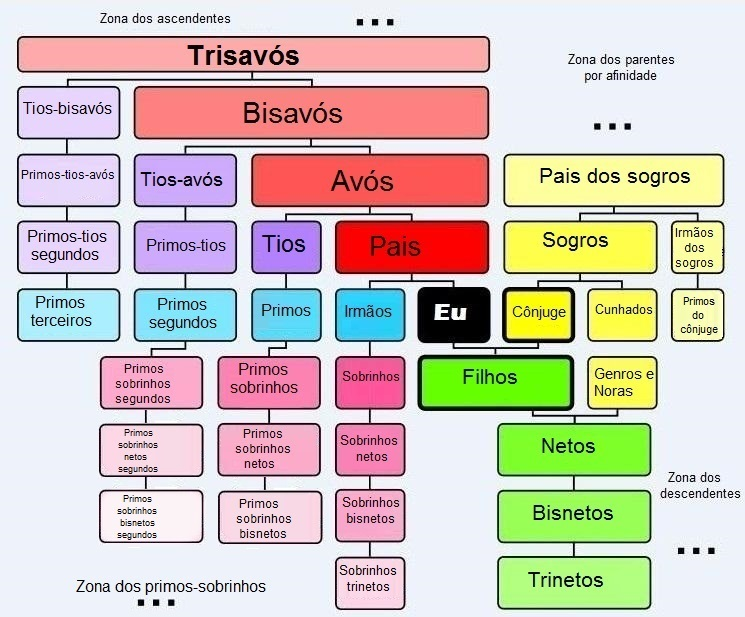

# Matriarcado Cognitivo

Modelo teórico onde a pessoa ascendente cognitivamente capaz é responsável por
coletar continuamente dados de importância ao desenvolvimento cognitivo de todas
as pessoas descendentes jovens. Então com ajuda de terceiros e em conjunto e,
necessariamente, aprovação dos genitores diretos dos filhos jovens,
poderá sugerir melhorias. Esse modelo teórico é sobre **estratégias de coleta
de dados e possivelmente coleção de referências científicas que poderiam
ser consideradas, e não sobre o que deve ou não ser feito.**

O nome dessa modelo teórico é **Matriarcado Cognitivo**, porém poderia ser
**Método Para Tios Que Você Nem Conhece Presenteem Algo Realmente Especial E Útil Em Vez De Roupa De Tamanho Errado**.

> **Um exemplo de coleta de dados**: A _Bizavó Silva_ não sabe ler nem escrever, mas **ADORA** ligar pra todo mundo.
> Podem achar que ela fala demais, mas ela é a pessoa que se da bem com todos.
> A _Tia-avó Silva_, que só sabia usar Facebook e WhatsApp passa a receber ajuda técnica _Primo-Tio 'Full-stack' Silva_,
> aprende a usar um programa maravilhoso, o _Planilhas Google para Android_,
> e, com ajuda e permissão da sua mãe, _Mãe Silva_, e seu pai, _Pai Silva_,
> juntam informações quais brinquedos você já tem, como você interage com seus pais,
> se você faz, e se faz, qual sua habilidade com atividades relacionadas esportes, música, artes, etc.

----

A imagem abaixo tem uma lista pra quem não lembra o que é sobrinho, tios-avos e afins.

## Motivação inicial

Emerson Rocha, desenvolvedor de software "Full-stack" trabalha também com
acessibilidade web e mais recentemente com acessibilidade cognitiva.
Isso quer dizer que até no tempo vago ele tem interesse em aprender sobre
o que afeta o desenvolvimento cognitivo de pessoas, pois _ganha dinheiro_
e ajudar a tornar o mundo um lugar melhor <3.

O mesmo Emerson Rocha, [assim como é menos raro com profisionais de TI](http://adultaddstrengths.com/2006/02/09/top-10-advantages-of-add-in-a-high-tech-career/)
também tem um transtorno mental incurável porém tratável, que é tem afetado
por hereditariedade chamado [Transtorno de Défice de Atenção e Hiperatividade (TDAH)](https://pt.wikipedia.org/wiki/Transtorno_do_d%C3%A9ficit_de_aten%C3%A7%C3%A3o_com_hiperatividade).

## O que é desenvolvimento cognitivo

> "O desenvolvimento cognitivo é um campo de estudo da neurociência e psicologia
> focada no desenvolvimento de uma criança em termos de processamento de informações,
> recursos conceituais, habilidade perceptiva, a aprendizagem de línguas,
> e outros aspectos do desenvolvimento do cérebro em relação ao ponto de vista de um adulto.
> Em outras palavras, o desenvolvimento cognitivo é o processo do surgimento da capacidade de pensar e compreende."
> -- [Fonte: Wikipédia](https://pt.wikipedia.org/wiki/Desenvolvimento_cognitivo)

_Nota: melhorar explicação (fititnt, 2017-02-28 02:56)_

## Tendência comum atual no desenvolvimento de crianças

Ninguém explica uma base cognitivamente otimizada mínima de como ser pai e mãe,
porém todos tentam dar o que consideram ser o seu melhor.
A tendência comum na criação de filhos pelos pais e mães é considerar:

1. Recomendações no pré-natal e pós-natal
2. Como foi a própria infância (mesmo que seja o que **não** fazer)
3. Legislação do momento conhecida pela família (pode bater no filho? pode xingar em publico?...)
4. Recomendações de saúde (vacinação, alimentação, etc...)
5. Local onde mora, tempo livre, renda (direta, de doações, apoio do governo, presentes...)
6. Educação escolar e crenças _rigidas_ dos genitores (religião, ideologia de gênero, ...)
7. Opinião dos próprios filhos

_Nota: melhorar explicação (fititnt, 2017-02-28 02:56)_

## O que coletar de dados?

Em breve deve ser adicionado aqui.

Sugestões para quem não não sabe usar _um
site chamado Github_ podem ser feitas diretamente com o Emerson Rocha Luiz
via e-mail emerson@alligo.com.br.
